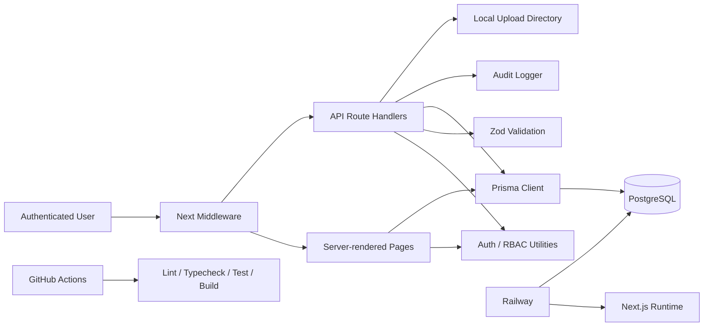
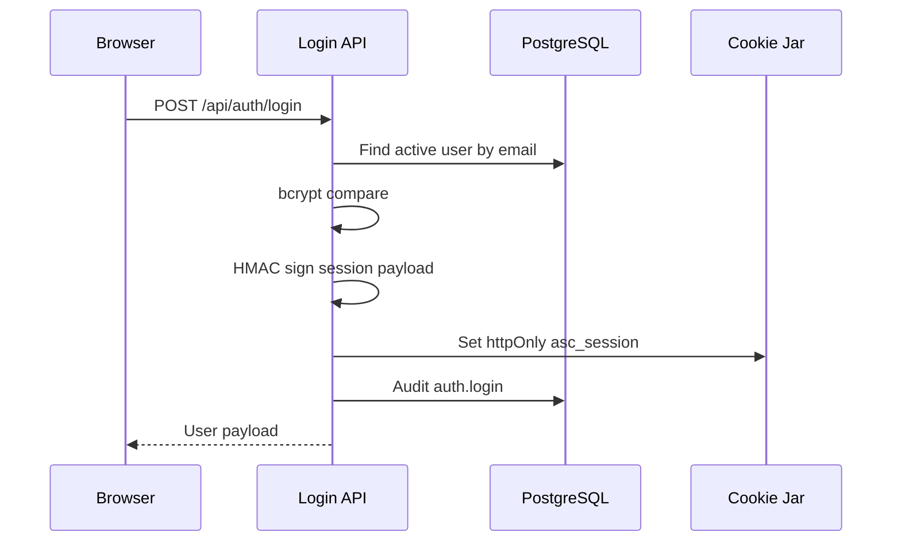

# Advanced Shop Management & Onboarding Command Center

Enterprise Technical and Operational Documentation

| Area | Detail |
| --- | --- |
| Product | Advanced Shop Management & Onboarding Command Center |
| Short Name | Advanced Shop Command Center |
| Repository Type | Next.js internal operations platform |
| Primary Runtime | Node.js 20+ |
| Primary Data Store | PostgreSQL through Prisma |
| Deployment Target | GitHub repository -> Railway app -> Railway PostgreSQL |
| Current Maturity | Production-oriented foundation, requires final validation and hardening before live operational use |

## Executive Summary

Advanced Shop Management & Onboarding Command Center is an internal operating platform for organizing people operations, department ticketing, onboarding, payroll coordination, approvals, recurring management work, and executive visibility. It is built for companies that need operational discipline without turning the platform into a formal compliance, payment, payroll-tax, or cybersecurity evidence system.

The platform centralizes work that would otherwise be scattered across email, spreadsheets, verbal requests, paper notes, and manager memory. Its core value is accountability: every operational request should have an owner, status, due date, history, and escalation path.

### Business Purpose

The application is designed to help a shop, manufacturing organization, service company, or department-heavy business move toward disciplined daily management. The system creates one internal command center for department requests, onboarding readiness, payroll coordination, time-off coordination, attendance notes, manager follow-ups, approvals, reports, and audit history.

### Strategic Value

| Value Driver | Current Implementation |
| --- | --- |
| Operational visibility | Executive, director, manager, employee, ticket, onboarding, payroll, and report pages exist. |
| Manager accountability | Department scoping, ticket ownership, due dates, status histories, blockers, approvals, and dashboard metrics are modeled. |
| Payroll coordination safety | Payroll request records are coordination-only and exclude banking, tax filing, and full SSN workflows. |
| Onboarding consistency | Onboarding request APIs, case data model, case list, and case detail page are implemented. |
| Audit readiness | Sensitive create, decision, export, upload, and seed actions call `recordAudit()` and persist to `audit_log`. |
| Deployment repeatability | Railway config, GitHub Actions, Prisma schema, migration, seed scripts, and environment template are included. |

### Key Capabilities

- Secure login using bcrypt password verification and signed httpOnly cookies.
- Server-side RBAC using four user levels: Level 1, Manager, Director, Global Admin / CEO.
- Department-scoped data access for managers and self-scoped ticket access for Level 1 users.
- PostgreSQL-backed operational records through Prisma.
- Seeded reference organization, roles, permissions, departments, shifts, ticket centers, categories, report templates, and safe settings.
- Core API endpoints for authentication, tickets, onboarding cases, payroll change requests, time-off requests, attendance issues, approvals, reports, file uploads, health, and protected database readiness.
- Command-center UI with executive dashboard, department ticket centers, onboarding detail views, payroll/readiness views, reports, and workflow workbenches.

### Production Readiness Assessment

| Domain | Assessment | Notes |
| --- | --- | --- |
| Architecture | Strong foundation | Clean Next.js App Router structure, service utilities, centralized Prisma client, shared validators, shared RBAC. |
| Data model | Broad but needs normalization pass | Prisma schema models all major domains. The committed SQL migration is generated as a broad initial migration and should be replaced with a canonical Prisma-generated migration before go-live. |
| Security | Foundational | Auth, signed cookies, bcrypt, server-side RBAC, validation, and audit hooks exist. Rate limiting, CSRF strategy, session rotation, account lockout, and complete policy enforcement still need implementation. |
| APIs | Core workflow coverage | Create/list APIs exist for major workflow records. Update, close, comment, bulk action, export file generation, and admin CRUD APIs remain incomplete. |
| UI | Strong operational shell | Dashboards and key pages exist. Several workflow workbench controls are presentational and not yet wired to live mutations. |
| Deployment | Ready for validation | Railway and CI configs exist. Requires package install, Prisma generate, migration validation, seed execution, and smoke testing. |
| Auditability | Good start | Audit logging exists for sensitive core actions. Coverage should be expanded to all update/delete/admin override paths when those paths are added. |

## System Architecture

### Architecture Overview

The system is a monolithic Next.js application with server-rendered pages and API route handlers. PostgreSQL is the system of record. Prisma provides data access. Authentication and authorization are enforced server-side.



### Service Boundaries

| Boundary | Responsibility | Current Location |
| --- | --- | --- |
| Web UI | Authenticated internal command-center pages | `src/app/(platform)` and `src/components` |
| Authentication | Login, logout, current user, signed sessions | `src/app/api/auth/*`, `src/lib/auth.ts` |
| Authorization | Permission and department scope checks | `src/lib/permissions.ts`, `src/lib/auth.ts` |
| Domain APIs | Workflow entry points | `src/app/api/*` |
| Validation | Request schema validation | `src/lib/validators.ts` |
| Persistence | Database client and models | `src/lib/prisma.ts`, `prisma/schema.prisma` |
| Auditing | Audit event persistence | `src/lib/audit.ts` |
| Reference Data | Product modules, departments, report types, categories | `src/lib/reference-data.ts`, `prisma/seed.ts` |
| Deployment | CI and Railway configuration | `.github/workflows/ci.yml`, `railway.json` |

### Runtime Flow

1. Browser requests a protected page or API route.
2. `src/middleware.ts` checks for the session cookie and redirects unauthenticated requests to `/login`, except public routes.
3. Page or API code calls `requireUser()` or `requirePermission()`.
4. `getCurrentUser()` verifies the HMAC-signed session token, loads the active user, then resolves permissions through `user_roles`, `role_permissions`, and `permissions`.
5. API routes validate request bodies with Zod.
6. Prisma writes or reads PostgreSQL records.
7. Sensitive operations call `recordAudit()` with actor, entity, before/after context where available, and outcome.
8. Responses use a consistent JSON envelope from `ok()` or `handleRouteError()`.
### Infrastructure Assumptions

| Component | Assumption |
| --- | --- |
| Node.js | Node 20+ in production. |
| Database | PostgreSQL 16 recommended. Railway PostgreSQL is the intended hosted database. |
| File uploads | Stored on local filesystem under `UPLOAD_DIR`. Replace with durable object storage for production scale. |
| Secrets | Provided through environment variables, not committed to source control. |
| HTTPS | Terminated by Railway or upstream ingress. Cookies are marked secure in production. |
| Background jobs | Not implemented. Recurring checklist generation and scheduled notifications require future job infrastructure. |

### Design Philosophy

- Keep operational records in PostgreSQL, not browser storage.
- Prefer server-side authorization over client-side hiding.
- Treat payroll as coordination and approval, not payroll processing.
- Keep sensitive data out of the platform by design.
- Make every serious action attributable through audit history.
- Start with a modular monolith to reduce distributed-system complexity until scale demands service extraction.

## Technical Stack

| Layer | Technology | Purpose |
| --- | --- | --- |
| Language | TypeScript | Application, route, validation, seed, and test code |
| Framework | Next.js 14 App Router | Server pages, route handlers, middleware, deployment |
| UI | React 18, global CSS, lucide-react | Command-center interface and icons |
| ORM | Prisma 5 | PostgreSQL data access and migrations |
| Database | PostgreSQL | Source of truth for operational records |
| Validation | Zod | Server-side request validation |
| Authentication | bcryptjs, HMAC-signed cookies | Password verification and stateless session token |
| Logging | pino | Structured server logging |
| Testing | Vitest | Unit and integration tests |
| CI | GitHub Actions | Install, Prisma generate, lint, typecheck, test, build |
| Deployment | Railway | App hosting and PostgreSQL |

## Installation & Setup

### Prerequisites

- Node.js 20.11 or newer
- npm
- PostgreSQL 16 recommended
- Git

### Local Setup

```bash
npm install
cp .env.example .env
npm run prisma:generate
npm run prisma:migrate
npm run seed:reference
npm run dev
```

Open `http://localhost:3000`.

### First Admin User

The reference seed only creates a user when both variables are set:

```bash
SEED_ADMIN_EMAIL="admin@example.com"
SEED_ADMIN_PASSWORD="replace-with-a-strong-password"
npm run seed:reference
```

The seed creates a Global Admin / CEO user and attaches the global admin role.

### Production Deployment

1. Push the repository to GitHub.
2. Create a Railway project from the GitHub repository.
3. Add Railway PostgreSQL.
4. Configure environment variables.
5. Deploy using `railway.json`.

Railway build command:

```bash
npm run build
```

Railway start command:

```bash
npm run prisma:deploy && npm run start
```

Health check: `/api/health`

Protected database readiness: `/api/admin/readiness`

## Configuration Documentation

### Environment Variables

| Variable | Required | Used By | Purpose | Security Notes |
| --- | --- | --- | --- | --- |
| `DATABASE_URL` | Yes | Prisma | PostgreSQL connection string | Secret. Store only in environment manager. |
| `SESSION_SECRET` | Yes | `src/lib/auth.ts` | HMAC signing key for session cookies | Must be at least 32 characters. Rotate carefully because active sessions become invalid. |
| `APP_URL` | Recommended | Deployment metadata | Canonical app URL | Not currently deeply integrated. |
| `NODE_ENV` | Yes | Next.js, auth, errors | Runtime mode | `production` enables secure cookies and hides stack details. |
| `SENTRY_DSN` | Optional | Future integration | Error monitoring | Variable exists but Sentry is not wired in code. |
| `UPLOAD_DIR` | Optional | File upload route | Filesystem upload location | Defaults to `./uploads`. Use durable storage before production scale. |
| `MAX_UPLOAD_BYTES` | Optional | Upload validation | Maximum upload size | Defaults to 10 MB. |
| `SEED_ADMIN_EMAIL` | Optional | Reference seed | First admin account email | Use only during controlled setup. |
| `SEED_ADMIN_PASSWORD` | Optional | Reference seed | First admin password | Secret. Rotate after initial setup if shared. |
| `ALLOW_DEMO_SEED` | Optional | Demo seed | Enables demo records | Must not be set in production. |

### Secrets Handling

- Secrets are expected to live in environment variables.
- `.env`, `.env.local`, and `.env.production` are ignored by Git.
- The database should not store API keys, payroll processor credentials, banking data, full SSNs, tax filing credentials, production passwords, payment card data, or protected health information.

### Feature Flags and Runtime Controls

| Control | Behavior |
| --- | --- |
| `ALLOW_DEMO_SEED=true` | Allows `seed:demo` to create sandbox data. Disabled by default. |
| `SEED_ADMIN_EMAIL` + `SEED_ADMIN_PASSWORD` | Creates or updates the initial Global Admin / CEO user during reference seed. |
| `MAX_UPLOAD_BYTES` | Controls upload size limit at runtime. |
| `NODE_ENV=production` | Enables secure cookies and hides internal error details. |
## Feature Documentation

### Authentication

| Aspect | Detail |
| --- | --- |
| Purpose | Provide secure access to the internal platform. |
| Inputs | Email and password through `/login`. |
| Outputs | Signed httpOnly cookie named `asc_session`. |
| Workflow | Validate login body -> find active user -> bcrypt password compare -> update last login -> set session cookie -> audit login. |
| Dependencies | `bcryptjs`, `SESSION_SECRET`, Prisma `users`. |
| Failure Scenarios | Invalid credentials return 401. Missing/weak `SESSION_SECRET` throws server error. Missing database prevents login. |
| Operational Notes | No password reset, MFA, account lockout, or session rotation currently exists. Add before broad production rollout. |

### Authorization and RBAC

| Aspect | Detail |
| --- | --- |
| Purpose | Enforce role and department scope server-side. |
| Inputs | Signed session, user roles, role permissions, requested permission key. |
| Outputs | Authenticated user object with resolved permission keys. |
| Workflow | `requirePermission()` -> `requireUser()` -> load user -> load role permissions -> fallback to role-level defaults if no role rows exist. |
| Dependencies | `users`, `user_roles`, `roles`, `role_permissions`, `permissions`. |
| Failure Scenarios | Missing session returns 401. Missing permission returns 403. |
| Operational Notes | Manager department scope is enforced in key APIs. Director scope currently allows all departments; assigned-department director scoping should be added if required. |

### Executive and Role Dashboards

| Aspect | Detail |
| --- | --- |
| Purpose | Show operational health by role. |
| Inputs | Authenticated user and organization scope. |
| Outputs | KPI cards, department health, recent tickets, onboarding queue, payroll readiness, approval queue, blockers. |
| Workflow | Server page calls `getCommandCenterData()` -> Prisma counts and lists -> dashboard renders server-side. |
| Dependencies | Tickets, onboarding cases, payroll requests, time-off requests, approvals, blockers, departments, payroll periods. |
| Failure Scenarios | Database outage breaks dashboard render. |
| Operational Notes | Scoring formulas are currently simple heuristics, not statistically validated KPIs. |

### Department Ticket Centers

| Aspect | Detail |
| --- | --- |
| Purpose | Give each department a distinct queue with ownership, categories, status, due dates, priority, and aging visibility. |
| Inputs | Ticket create payload with department, center, title, description, priority, due date, and optional links. |
| Outputs | Ticket record, ticket status history, audit log event. |
| Workflow | Validate body -> permission check -> department-scope check -> transaction creates ticket and initial status history -> audit event. |
| Dependencies | `tickets`, `ticket_centers`, `ticket_categories`, `ticket_status_history`, `audit_log`. |
| Failure Scenarios | Invalid body returns 422. Department scope violation returns 403. |
| Operational Notes | Update, close, reopen, comment, internal note, attachment linking, transfer, and bulk update endpoints are not yet implemented. |

### Onboarding Requests and Cases

| Aspect | Detail |
| --- | --- |
| Purpose | Coordinate new hire, contractor, temp, rehire, transfer, role change, shift, and location onboarding. |
| Inputs | Employee and job details, start date, setup requirements, manager/director assignments, readiness notes. |
| Outputs | Onboarding case, onboarding status history, audit event. |
| Workflow | Validate body -> permission/scope check -> transaction creates case and status history -> audit event. |
| Dependencies | `onboarding_cases`, `onboarding_status_history`, related task, ticket, document, milestone, blocker, and approval tables. |
| Failure Scenarios | Invalid date or missing required fields return 422. Department scope violation returns 403. |
| Operational Notes | Case detail page reads linked records. Automated task generation from templates is modeled but not implemented. |

### Payroll Coordination

| Aspect | Detail |
| --- | --- |
| Purpose | Track payroll-related management requests without processing payroll or storing payroll-sensitive credentials/data. |
| Inputs | Request type, employee reference, department, effective date, proposed change summary, business reason, approval flags. |
| Outputs | Payroll change request, status history, audit event. |
| Workflow | Validate body -> payroll permission -> department scope -> transaction creates request and status history -> audit event. |
| Dependencies | `payroll_change_requests`, `payroll_request_status_history`, `payroll_periods`, `payroll_exports`, `audit_log`. |
| Failure Scenarios | Missing business reason returns 422. Unauthorized access returns 401/403. |
| Operational Notes | Export route records metadata only. It does not generate payroll processor files. No tax calculation, wage calculation, or payroll submission exists. |

### Time-Off Coordination

| Aspect | Detail |
| --- | --- |
| Purpose | Coordinate requests, manager review, coverage notes, and payroll handoff flags. |
| Inputs | Employee profile, department, manager, type, start/end dates, hours/days, coverage plan, payroll note flag. |
| Outputs | Time-off request and audit event. |
| Workflow | Validate body -> permission/scope check -> create request -> audit event. |
| Dependencies | `time_off_requests`, `audit_log`. |
| Failure Scenarios | Invalid body returns 422. |
| Operational Notes | Approval/decision endpoints for time-off are not implemented yet. |

### Attendance and Schedule Issues

| Aspect | Detail |
| --- | --- |
| Purpose | Track non-sensitive attendance and schedule coordination items. |
| Inputs | Employee, issue type, date, shift, description, correction flag, payroll impact flag. |
| Outputs | Attendance issue record and audit event. |
| Workflow | Validate body -> permission/scope check -> create record -> audit event. |
| Dependencies | `attendance_issue_records`, `audit_log`. |
| Failure Scenarios | Invalid body returns 422. |
| Operational Notes | Schedule issue and time correction tables exist, but only attendance issue API is currently implemented. |

### Approval Queue

| Aspect | Detail |
| --- | --- |
| Purpose | Centralize workflow approvals and decision records. |
| Inputs | Approval type, source type, source ID, department, owner, priority, due date, summary. |
| Outputs | Approval request, approval decision, audit event. |
| Workflow | Create approval -> decision endpoint checks `approval:decide` -> blocks self-approval -> writes decision and updates approval status. |
| Dependencies | `approval_requests`, `approval_decisions`, `audit_log`. |
| Failure Scenarios | Missing approval returns 404. Self-approval returns 403. Invalid decision returns 422. |
| Operational Notes | Multi-step approval routing is modeled but not fully executed by current APIs. |

### Reports and Exports

| Aspect | Detail |
| --- | --- |
| Purpose | Track generated management reports and export history. |
| Inputs | Report type, title, department, date range, filters, optional format. |
| Outputs | Report record, optional report export record, audit event. |
| Workflow | Validate body -> `report:view` permission -> `report:export` if format requested -> create report -> create export metadata -> audit event. |
| Dependencies | `reports`, `report_exports`, `report_templates`, `audit_log`. |
| Failure Scenarios | Unauthorized export returns 403. Invalid body returns 422. |
| Operational Notes | Binary PDF/DOCX/XLSX/CSV/HTML/JSON file generation is not implemented. Current route records report/export metadata only. |

### File Uploads

| Aspect | Detail |
| --- | --- |
| Purpose | Store allowed non-sensitive files and metadata. |
| Inputs | Multipart form with `file`, optional `safeUse`, optional `departmentId`. |
| Outputs | File stored under `UPLOAD_DIR`, `file_metadata` row, audit event. |
| Workflow | Permission check -> validate file presence/type/size -> checksum -> write with exclusive flag -> save metadata -> audit event. |
| Dependencies | Local filesystem, `file_metadata`, `audit_log`. |
| Failure Scenarios | Missing file 422, unsupported type 415, too large 413, filesystem errors 500. |
| Operational Notes | Production should use durable object storage and malware scanning. Local disk is fragile in multi-instance deployments. |

### Reference Seed

| Aspect | Detail |
| --- | --- |
| Purpose | Bootstrap safe reference configuration without fake production records. |
| Inputs | Optional admin email/password. |
| Outputs | Organization, roles, permissions, departments, ticket centers, categories, shifts, locations, job titles, report templates, settings, audit event. |
| Workflow | Upsert reference data -> optionally create admin -> audit seed completion. |
| Dependencies | Prisma, PostgreSQL, bcrypt. |
| Failure Scenarios | Missing database or migration failures stop seed. |
| Operational Notes | Demo seed is gated behind `ALLOW_DEMO_SEED=true` and must not run in production. |
## API Documentation

All protected endpoints require the `asc_session` cookie. Responses use a standard envelope:

```json
{
  "ok": true,
  "data": {}
}
```

Error envelope:

```json
{
  "ok": false,
  "error": {
    "code": "validation_error",
    "message": "The request is missing required fields or contains invalid values."
  }
}
```

### Endpoint Inventory

| Endpoint | Methods | Auth | Purpose |
| --- | --- | --- | --- |
| `/api/health` | `GET` | Public | Service liveness. |
| `/api/admin/readiness` | `GET` | `admin:manage` | Protected database readiness check. |
| `/api/auth/login` | `POST` | Public | Authenticate and set session cookie. |
| `/api/auth/logout` | `POST` | Optional current user | Clear session cookie and audit logout when user exists. |
| `/api/auth/me` | `GET` | Authenticated | Return current resolved user and permissions. |
| `/api/tickets` | `GET`, `POST` | `ticket:view`, `ticket:create` | List and create tickets. |
| `/api/onboarding-cases` | `GET`, `POST` | `onboarding:view`, `onboarding:create` | List and create onboarding cases. |
| `/api/payroll/change-requests` | `GET`, `POST` | `payroll:view`, `payroll:create` | List and create payroll coordination requests. |
| `/api/time-off` | `GET`, `POST` | `timeoff:view`, `timeoff:create` | List and create time-off requests. |
| `/api/attendance/issues` | `GET`, `POST` | `attendance:view`, `attendance:create` | List and create attendance issue records. |
| `/api/approvals` | `GET`, `POST` | `approval:view` | List and create approval requests. |
| `/api/approvals/[id]/decisions` | `POST` | `approval:decide` | Decide an approval and block self-approval. |
| `/api/reports` | `GET`, `POST` | `report:view`, optional `report:export` | List reports and create report/export metadata. |
| `/api/files` | `POST` | `file:upload` | Upload allowed non-sensitive files. |

### Validation

Request validation lives in `src/lib/validators.ts`.

| Schema | Used By |
| --- | --- |
| `loginSchema` | `/api/auth/login` |
| `ticketCreateSchema` | `/api/tickets` |
| `onboardingCreateSchema` | `/api/onboarding-cases` |
| `payrollCreateSchema` | `/api/payroll/change-requests` |
| `timeOffCreateSchema` | `/api/time-off` |
| `attendanceIssueCreateSchema` | `/api/attendance/issues` |
| `approvalCreateSchema` | `/api/approvals` |
| `reportCreateSchema` | `/api/reports` |

### Rate Limits

No application-level rate limiting is currently implemented. Before external or broad internal exposure, add rate limiting for login, file upload, mutation, and report/export endpoints.

## Security & Audit Readiness

### Authentication Flow



### Authorization Model

| Level | Permission Model |
| --- | --- |
| Level 1 | Self-service tickets, onboarding visibility, payroll question creation, time-off creation, attendance creation, task view, file upload. |
| Manager | Department ticket management, onboarding management, payroll request creation, time-off approval, attendance management, tasks, checklists, approvals, reports, notes, announcements. |
| Director | Cross-department operations, escalations, onboarding approval, payroll approval, reports/export, lifecycle management. |
| Global Admin / CEO | Full permission set. |

Department scoping:

- Global Admin and Director currently pass department checks.
- Manager access is limited to `user.departmentId`.
- Level 1 users are self-scoped in ticket listing and restricted from cross-department access helpers.

### Logging Strategy

Structured logging uses `pino` through `src/lib/logger.ts`. Audit logging uses `recordAudit()` and writes to `audit_log`.

Currently audited:

- Login and logout
- Ticket creation
- Onboarding case creation
- Payroll request creation
- Time-off request creation
- Attendance issue creation
- Approval creation and decision
- Report generation/export metadata
- File upload
- Reference seed completion

### Data Handling Boundaries

The code intentionally avoids direct processing of bank account numbers, full SSNs, payroll tax calculations, payroll processor credentials, payment cards, protected health information, cybersecurity secrets, and formal compliance evidence packages. Payroll records are coordination records only.

### Security Controls Present

| Control | Status |
| --- | --- |
| bcrypt password verification | Implemented |
| Signed httpOnly cookies | Implemented |
| Secure cookie in production | Implemented |
| Server-side RBAC | Implemented |
| Server-side validation | Implemented |
| Audit trail utility | Implemented |
| File type and size limits | Implemented |
| Generic production errors | Implemented |
| Security headers | Implemented in `next.config.mjs` |
| Protected DB readiness endpoint | Implemented |

### Security Gaps

| Gap | Risk | Recommendation |
| --- | --- | --- |
| No CSRF token strategy | Cookie-authenticated POSTs can be exposed to CSRF depending on deployment context | Add CSRF tokens or same-origin mutation guard. |
| No rate limiting | Brute force and upload abuse risk | Add rate limits at edge and app layers. |
| No MFA | Admin compromise risk | Add MFA for Director and Global Admin roles. |
| No account lockout | Password guessing risk | Track failed login attempts and lock temporarily. |
| No password reset flow | Operational support burden | Add secure invite/reset flow. |
| No session revocation table | Signed cookies remain valid until expiry | Add session store or token versioning for forced logout. |
| Uploads on local disk | Data loss in ephemeral or multi-instance environments | Move to object storage with scanning. |
| Director scope broad | Directors can view all departments | Add assigned department scope if required. |
| Migration generated broadly | Database shape may drift from Prisma expectations | Replace with canonical Prisma migration before production. |
## Reliability & Operations

### Monitoring Recommendations

Add monitoring for request latency, error rate by route, login failures, database errors, Prisma errors, file upload failures, audit write failures, migration failures, Railway health check failures, and storage consumption.

Recommended tools:

- Railway metrics
- Sentry or equivalent error reporting
- PostgreSQL slow query logs
- Uptime checks against `/api/health`
- Protected scheduled readiness checks against `/api/admin/readiness`

### Backup and Recovery Assumptions

| Asset | Current Assumption | Production Requirement |
| --- | --- | --- |
| PostgreSQL | Railway managed database | Configure automated backups, PITR if available, and restore drills. |
| Uploaded files | Local `UPLOAD_DIR` | Move to durable object storage and back up metadata plus objects. |
| Environment variables | Railway environment | Store in secret manager, restrict access, document rotation. |
| Audit log | Database table | Include in backup policy and retention policy. |

### Operational Runbooks

#### App Fails Health Check

1. Check Railway deploy logs.
2. Confirm `npm run build` completed.
3. Confirm `DATABASE_URL` and `SESSION_SECRET` exist.
4. Check `/api/health`.
5. If app is up but data pages fail, check `/api/admin/readiness` as Global Admin.

#### Login Fails

1. Confirm admin user exists from `seed:reference`.
2. Confirm `SEED_ADMIN_EMAIL` and `SEED_ADMIN_PASSWORD` were set before seed.
3. Confirm `SESSION_SECRET` length is at least 32 characters.
4. Check user status is `ACTIVE`.
5. Review `audit_log` for login events.

#### Database Migration Fails

1. Confirm `DATABASE_URL` points to the intended PostgreSQL instance.
2. Run `npm run prisma:generate`.
3. Run `npm run prisma:deploy`.
4. If migration drift appears, regenerate a canonical migration from `prisma/schema.prisma` in a clean database.

#### File Upload Fails

1. Confirm authenticated user has `file:upload`.
2. Confirm MIME type is allowed.
3. Confirm file size is under `MAX_UPLOAD_BYTES`.
4. Confirm `UPLOAD_DIR` exists or can be created by the runtime.
5. Check disk capacity and write permissions.

#### Payroll Export Expectations

Current code records export metadata only. If an operator expects a downloadable file, that is not implemented yet. Add file generation and storage before operational handoff.

## Codebase Intelligence

### Folder Structure

```text
.
├── .github/workflows/ci.yml
├── prisma/
│   ├── schema.prisma
│   ├── seed.ts
│   ├── seed-demo.ts
│   └── migrations/
├── scripts/
│   └── generate-initial-migration.cjs
├── src/
│   ├── app/
│   │   ├── (platform)/
│   │   ├── api/
│   │   ├── globals.css
│   │   ├── layout.tsx
│   │   └── login/
│   ├── components/
│   ├── lib/
│   └── middleware.ts
├── tests/
├── package.json
├── railway.json
├── README.md
└── DOCUMENTATION.md
```

### Critical Modules

| Module | Purpose |
| --- | --- |
| `src/lib/auth.ts` | Session signing, cookie management, current user lookup, permission enforcement, department access helper. |
| `src/lib/permissions.ts` | Permission catalogue and defaults by user level. |
| `src/lib/validators.ts` | Zod schemas for API request bodies. |
| `src/lib/audit.ts` | Central audit event writer. |
| `src/lib/http.ts` | JSON response envelopes and error handling. |
| `src/lib/dashboard.ts` | Dashboard aggregation logic. |
| `src/lib/reference-data.ts` | Product modules, departments, categories, statuses, report types, and navigation metadata. |
| `src/lib/prisma.ts` | Prisma singleton. |
| `src/middleware.ts` | Coarse session-cookie gate for protected routes. |
| `prisma/schema.prisma` | Domain data model. |
| `prisma/seed.ts` | Safe reference seed. |

### Extension Points

- Add update/comment/close APIs next to existing create/list APIs.
- Add richer workflow state machines by extending status history tables.
- Add assigned director department scoping through a director-department join table.
- Replace local file storage with S3-compatible object storage.
- Add background workers for recurring checklist generation and notification delivery.
- Replace metadata-only report exports with real PDF/DOCX/XLSX/CSV/HTML/JSON generation.
- Add row-level business policy services above Prisma calls.

### Technical Debt Observations

| Area | Observation |
| --- | --- |
| Migration | The initial migration was generated broadly from the Prisma schema and creates a superset column shape for all tables. It is useful for bootstrapping but should be replaced with a canonical Prisma migration before go-live. |
| Prisma relations | The schema uses scalar IDs and indexes but does not define full `@relation` mappings. This keeps early modeling flexible but limits referential enforcement. |
| UI action wiring | Several module workbench buttons are presentational. They do not yet submit to mutation APIs. |
| API completeness | Create/list endpoints exist for core workflows. Update, delete/archive, transition, comment, attachment association, bulk operations, and admin CRUD are incomplete. |
| Report generation | Export metadata exists, but binary report generation does not. |
| Security hardening | Rate limiting, CSRF protection, MFA, account lockout, and session revocation are missing. |
## Developer Experience

### Contribution Workflow

```bash
npm install
npm run prisma:generate
npm run lint
npm run typecheck
npm run test
npm run build
```

### Testing Workflow

| Command | Purpose |
| --- | --- |
| `npm run test` | Run all Vitest tests. |
| `npm run test:unit` | Run unit tests. |
| `npm run test:integration` | Run integration tests. |
| `npm run typecheck` | TypeScript validation. |
| `npm run lint` | Next.js linting. |
| `npm run build` | Prisma generate and Next.js production build. |

Current tests cover permission boundaries, validator behavior, and the health endpoint.

Testing gaps:

- Auth/login integration
- RBAC department scope integration
- API mutation happy paths and failures
- File upload route
- UI render tests
- E2E workflows
- Migration smoke test against clean PostgreSQL

### Debugging Guidance

| Symptom | First Check |
| --- | --- |
| Redirect loop to `/login` | Missing/invalid `asc_session`, weak/missing `SESSION_SECRET`, or inactive user. |
| 401 | No valid session. |
| 403 | Missing permission or department scope failure. |
| 422 | Zod validation failure. Inspect response issues. |
| 500 in production | Check server logs because production hides internal error messages. |
| Empty dashboards | Seed reference data and confirm records exist in scoped departments. |
| Upload failure | Confirm MIME type, size, permissions, and `UPLOAD_DIR`. |

### Best Practices

- Add all new mutation endpoints behind `requirePermission()`.
- Validate all request bodies with Zod.
- Call `recordAudit()` for sensitive creates, updates, decisions, exports, uploads, overrides, and admin changes.
- Keep payroll fields coordination-focused.
- Do not add sensitive identifiers or credentials to database models.
- Keep UI state backed by PostgreSQL for operational records.
- Prefer explicit status history rows for meaningful workflow transitions.

## Known Risks & Limitations

| Risk / Limitation | Impact | Recommended Action |
| --- | --- | --- |
| No rate limiting | Login and mutation endpoints can be abused | Add edge and application rate limits. |
| No CSRF protection | Cookie-auth POST routes need stronger browser-origin protection | Add CSRF tokens or equivalent same-origin mutation guard. |
| No MFA | Admin compromise risk | Add MFA for Director and Global Admin. |
| No password reset/invite flow | Manual account operations | Add secure invite and reset workflows. |
| No account lockout | Brute-force risk | Track failed attempts and temporarily lock accounts. |
| No session revocation | Cannot force logout all sessions | Add session table or token versioning. |
| Local file storage | Data loss or inconsistency in scaled deployments | Move uploads to durable object storage. |
| No malware scanning | Uploaded files may carry risk | Add scanning pipeline. |
| Broad Director scope | Directors can access all departments | Add assigned director scopes if needed. |
| Metadata-only exports | Users cannot download real report files | Implement export generation. |
| Generated initial migration | Possible schema drift and weak database constraints | Replace with canonical Prisma migration. |
| No foreign keys | Referential integrity is application-managed | Add Prisma relations and DB FKs before production scale. |
| Limited workflow transitions | Create/list exists, but lifecycle operations are incomplete | Add update, transition, close, reopen, comment, and bulk endpoints. |
| Static module workbench actions | Some UI controls are not operationally wired | Connect forms to APIs or replace with live components. |
| No backup automation in repo | Recovery depends on hosting configuration | Configure Railway backups and restore drills. |
| No observability integration | Production diagnosis is limited | Wire Sentry or equivalent and route-level metrics. |

## Future Roadmap

### Immediate Hardening

- Run full install, Prisma generate, migration, lint, typecheck, tests, and build in a clean environment.
- Replace generated broad migration with canonical Prisma migration from a clean database.
- Add rate limiting and CSRF protection.
- Add account lockout and password reset/invite flow.
- Expand audit coverage to all future update/delete/admin operations.
- Add API tests for each implemented route.

### Product Completion

- Implement ticket updates, status transitions, comments, internal notes, attachments, transfers, reopen, and bulk update.
- Implement onboarding template task generation.
- Implement payroll period checklist operations and safe export file generation.
- Implement time-off decisions and department calendar views.
- Implement attendance time correction and schedule issue APIs.
- Implement approval step routing and escalation automation.
- Wire module workbench controls to real APIs.
- Build admin CRUD for roles, permissions, departments, locations, shifts, categories, templates, settings, and integrations.

### Security Hardening

- Add MFA for privileged roles.
- Add session revocation and token versioning.
- Add stricter director department scoping.
- Add object storage with signed URLs and malware scanning.
- Add data retention policies.
- Add audit export controls and immutable log strategy.

### Scalability Evolution

- Move recurring checklist generation and notifications to background jobs.
- Add queue infrastructure for report generation and imports.
- Add caching for dashboard aggregates.
- Add database indexes tuned from production query plans.
- Add read replicas if reporting traffic grows.
- Add organization-level tenant isolation tests.

### Developer Experience Improvements

- Add API contract tests.
- Add Playwright E2E tests for login, dashboard, ticket create, onboarding create, approval decision, and upload.
- Add seed reset utilities for development.
- Add component previews for the command-center UI.
- Add ADRs for auth, RBAC, workflow state, file storage, and reporting.

## Validation Required Before Production

- [ ] Install dependencies with `npm install`.
- [ ] Run `npm run prisma:generate`.
- [ ] Replace or validate the initial migration against a clean PostgreSQL database.
- [ ] Run `npm run prisma:migrate` locally.
- [ ] Run `npm run seed:reference` with initial admin credentials.
- [ ] Run `npm run lint`.
- [ ] Run `npm run typecheck`.
- [ ] Run `npm run test`.
- [ ] Run `npm run build`.
- [ ] Deploy to Railway staging.
- [ ] Confirm `/api/health`.
- [ ] Log in as Global Admin / CEO.
- [ ] Confirm `/api/admin/readiness`.
- [ ] Create a ticket, onboarding case, payroll request, time-off request, attendance record, approval, report, and file upload in staging.
- [ ] Review audit log entries for each sensitive operation.
- [ ] Configure backups and restore procedure.
- [ ] Configure monitoring and alerting.
- [ ] Complete security hardening items required by the organization.

## Operational Boundary Statement

This platform supports internal management, onboarding, payroll coordination, department ticketing, productivity tracking, and employee lifecycle documentation. It does not process payments, store banking credentials, replace payroll tax systems, or directly modify HR, payroll, accounting, IT, or production systems unless an approved integration is explicitly configured.

It is not a CMMC platform, PCI platform, cybersecurity evidence platform, vulnerability management tool, formal audit packet builder, payroll tax engine, or payment system.